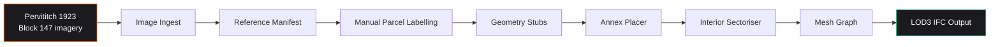

# HUMS — Pervititch 1923 Block 147

> LOD3 BIM reconstruction pipeline for the Pervititch insurance maps of historic Istanbul.

[](https://www.python.org/)
[]()
[](LICENSE)
[](PRDs/)

---

## What this is

The **Pervititch maps** (1922-1945) are the most detailed surviving record of Istanbul's pre-modern fabric — block-by-block, building-by-building, with materials and floor heights. **HUMS** turns one of those blocks (Block 147 in the 1923 atlas) into a structured **LOD3 Building Information Model (BIM)** that downstream tools can render, simulate, or export to IFC.

This is heritage informatics — the bridge between paper-era cartography and modern 3D city models.

---

## Why it exists

Most digital recreations of historic Istanbul stop at footprints. LOD3 means **per-facade geometry, openings, materials, and roof structure** — useful for:

- Heritage research and preservation planning
- Architectural-history visualization
- Simulation (energy, seismic, lighting) on lost or altered buildings
- Comparative urban-fabric analysis vs. modern cadastral data

---

## Architecture



---

## Project structure

```
hums/
├── src/hums/
│   ├── geo/              # Coordinate reference systems, projections
│   ├── imagery/          # Image ingest + reference manifest
│   ├── render/           # Mesh graph construction
│   └── stubs/            # Geometry stubs, annex placer, sectoriser
├── data/
│   ├── manual/           # Manually labelled parcels
│   └── raw/              # Source Pervititch imagery
├── PRDs/                 # 5 product requirements docs (versioned design)
└── pyproject.toml
```

---

## PRD-driven development

This project ships through small, versioned design documents:

| PRD | Scope |
|---|---|
| **001** | Data foundation — coordinate systems, image manifest, raw ingest |
| **002** | LOD3 data model and geometry stubs |
| **003** | LOD3 geometry + IFC export |
| **004** | Visual fidelity, church-typology handling |
| **005** | Manual parcel labelling workflow |

Each PRD has an explicit acceptance criterion before the next opens.

---

## Tech stack

| Layer | Choice |
|---|---|
| Language | Python 3.14 |
| Geometry | `shapely` 2.0 |
| Projections | `pyproj` |
| Vector I/O | `pyshp` |
| Spreadsheet I/O | `openpyxl` |
| XML/IFC | `lxml` |
| Lint | `ruff` |
| Test | `pytest` |

---

## Quick start

```bash
git clone https://github.com/1lker/hums-project.git
cd hums-project
pip install -e ".[dev]"
make build
```

---

## Author

**İlker Yörü** — CTO @ [Mindra](https://mindra.co)
[GitHub](https://github.com/1lker) · [LinkedIn](https://linkedin.com/in/ilker-yoru) · [ilkeryoru.com](https://ilkeryoru.com)

## License

MIT — see [LICENSE](LICENSE)
